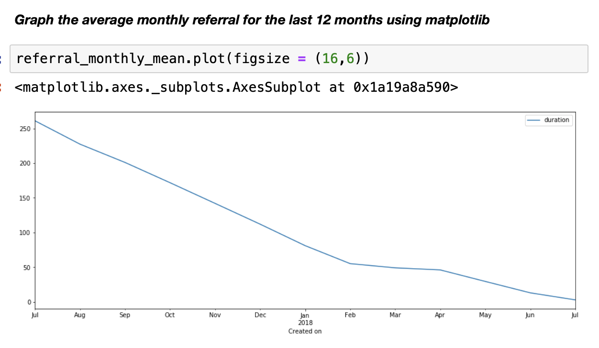
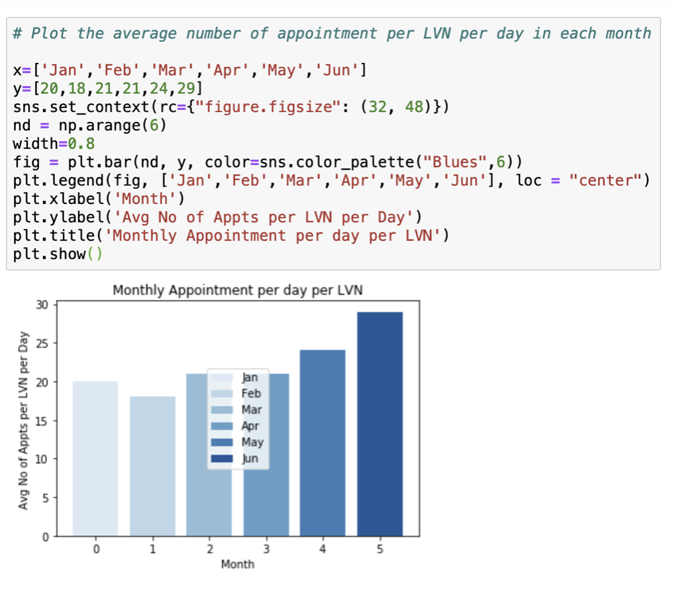

#### Analyst_Test_Tasks:
* As a mediator, connector, and ambassador, the business analyst must bring the business needs together with IT resources.
A business analyst's responsible for collecting, analyzing, communicating, and document requirements, user-testing, and 
many more. He/she is the bridge that fills in the gap between each department throughout every step of development. 
* This study focus on a workday of a business analyst. Data was obtained from a healthcare system. 
#### Objective:
  1. Determine how uncompleted workload is divided among care coordinators.
  2. Compare the average duration, from created to completed, of the referral takss in the last 12 months by month and graph it.
  3. Determine relationship between target variable and dependent variables.
  4. Calculate the average number of appointment per nurse per day for each month.
  5. Report the findings and communicating the results with stakeholders.
#### Solutions:
Plot data distribution to have a general knowledge how data were distributed.

Create a dataframe where tasks aren't completed among care coordinators.

Extract information where uncompleted tasks assinged to care coordinators.

Average duration by month for completed tasks for 12 month where tasks = referral (unit:day)

Our predictive variable (PRS)  is a continuous dependent variable. Multilinear Regression Model is the best way to find relationships among these particular features. Let see what we have learn from our model:
  1.Gender doesn’t have a significant impact on PRS (P-value >>> 0.05).
  2.Subzone[T.5e] has a certain impact on PRS (P-value < 0.05). 
  3.Patients who live in this zone have a tendency of not adhere to their schedule by 0.24 or 24%.
  4. Age does have a strong effect on PRS (P-value <<<0.05), a patient with a year older tend to have a decline in commitment to their doctor’s appointment by 1.6%.
  5. Chronic_conditions does not have any impact on whether or not a person is likely to keep his/her appt.

Suggestions:
This is just a test; building a model to predict a predictive require time, reliable non-bias resources. Different models could be used and validated before an optimal model is found. 

Average number of appointments per day per LVN in each month for the year 2018.

