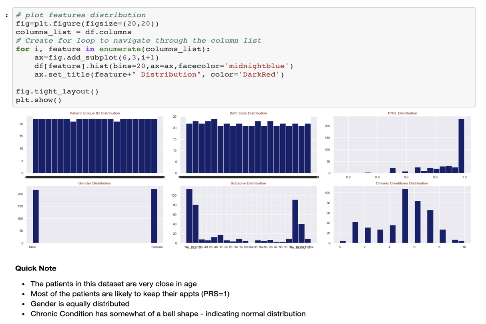
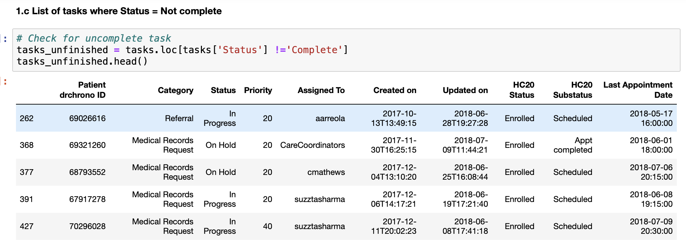
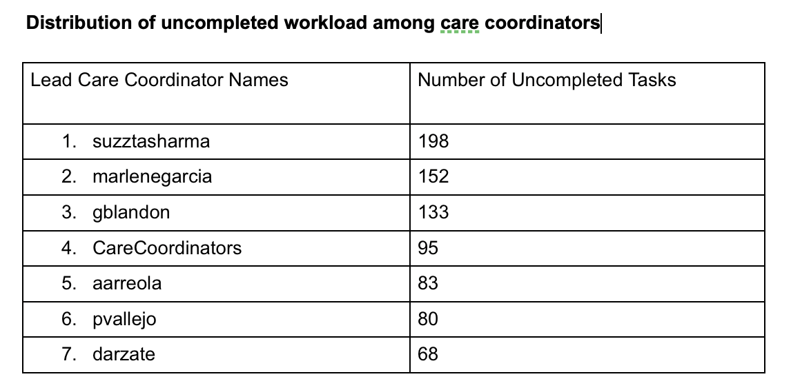

#### Analyst_Test_Tasks:
* As a mediator, connector, and ambassador, the business analyst must bring the business needs together with IT resources.
A business analyst's responsible for collecting, analyzing, communicating, and document requirements, user-testing, and 
many more. He/she is the bridge that fills in the gap between each department throughout every step of development. 
* This study focus on a workday of a business analyst. Data was obtained from a healthcare system. 
#### Objective:
  1. Determine how uncompleted workload is divided among care coordinators.
  2. Compare the average duration, from created to completed, of the referral takss in the last 12 months by month and graph it.
  3. Determine relationship between target variable and dependent variables.
  4. Calculate the average number of appointment per nurse per day for each month.
  5. Report the findings and communicating the results with stakeholders.
#### Solutions:
Plot data distribution to have a general knowledge how data were distributed.

Create a dataframe where tasks aren't completed among care coordinators.

Extract information where uncompleted tasks assinged to care coordinators.

