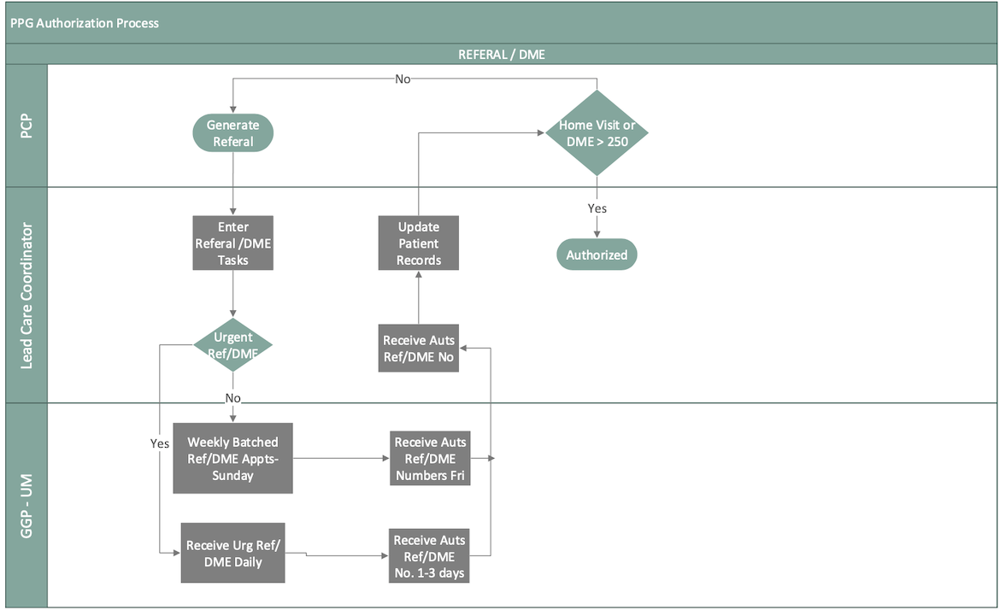
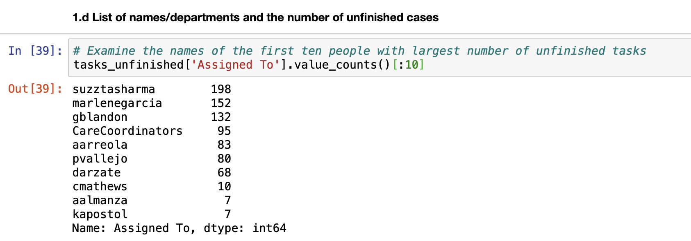
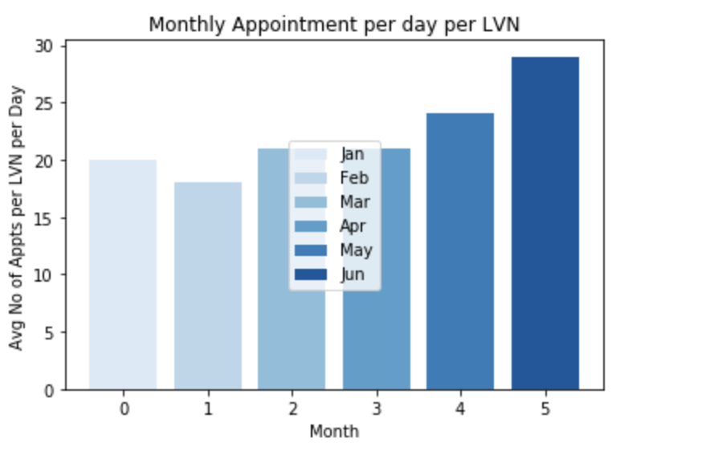

#### Analyst_Test_Tasks:

* As a mediator, connector, and ambassador, the business analyst must bring the business needs together with IT resources.
A business analyst's responsible for collecting, analyzing, communicating, and document requirements, user-testing, and 
many more. He/she is the bridge that fills in the gap between each department throughout every step of development. 
* This study focus on a workday of a business analyst. Data was obtained from a healthcare system. 

#### Objective:

  1. Create a deployment flowchart - Cross functional Flowchart to articulate the steps and stakeholders: Lead Care Coordinator - LCC , Primary Care Physicians -PCP, and Physician Provider Group Utilization Manager-  PPG-UM of an given authorization process. An authorization is requested for referral a patient to see a specialist such as Cardiologist, Hemotologist, Dermatologist,...et. An authorization has to be granted for a patient to obtain a Durable Medical Equipment -DME such as wheelchair, feeding tube, Nebulizer machine,.. etc.
  2. Determine how uncompleted workload is divided among care coordinators.
  3. Compare the average duration, from created to completed, of the referral takss in the last 12 months by month and graph it.
  4. Determine relationship between target variable and dependent variables.
  5. Calculate the average number of appointment per nurse per day for each month.
  6. Report the findings and communicating the results with the stakeholders.

#### Solutions:

* Referral and Durable Medical Equipment Authorization Process

* Notes:
  * Providers: nurse practitioner or physician enter DME/Referral requests in the patient's record
  * Every Sunday a LCC sends a list of DMEs/Referrals to the PPG-UM and the PPG-UM respond on Friday
  * Every day a LCC sends a list of a new Urgent Referral/DME to the PPG-UM and the PPG-UM has to respond within 1-3 days with the authorization
  * The LCC is responsible for updating such authorization in the patient's record

* Plot data distribution to have a general knowledge how data were distributed.

Create a dataframe where tasks aren't completed among care coordinators.

Extract information where uncompleted tasks assinged to care coordinators.

Average duration by month for completed tasks for 12 month where tasks = referral (unit:day)

* Notes:
On July, 2017 the number of referrals are 250. It decreases gradually to a little over 50 referrals for the month of Feb, 2018. It maintains 50 referrals for three months from Feb - April, 2018, and then starts going down. At July 2018 the referral for that month is almost zero !
#### Modeling:
Our predictive variable (PRS)  is a continuous dependent variable. Multilinear Regression Model is the best way to find relationships among these particular features. Let see what we have learn from our model:

  * 1. Gender doesn’t have a significant impact on PRS (P-value >>> 0.05).
  * 2. Subzone[T.5e] has a certain impact on PRS (P-value < 0.05). 
  * 3. Patients who live in this zone have a tendency of not adhere to their schedule by 0.24 or 24%.
  * 4. Age does have a strong effect on PRS (P-value <<<0.05), a patient with a year older tend to have a decline in                  commitment to their doctor’s appointment by 1.6%.
  * 5. Chronic_conditions does not have any impact on whether or not a person is likely to keep his/her appt.

##### Suggestions:
This is just a test; building a model to predict a predictive require time, reliable non-bias resources. Different models could be used and validated before an optimal model is found. 

Average number of appointments per day per LVN in each month for the year 2018.

